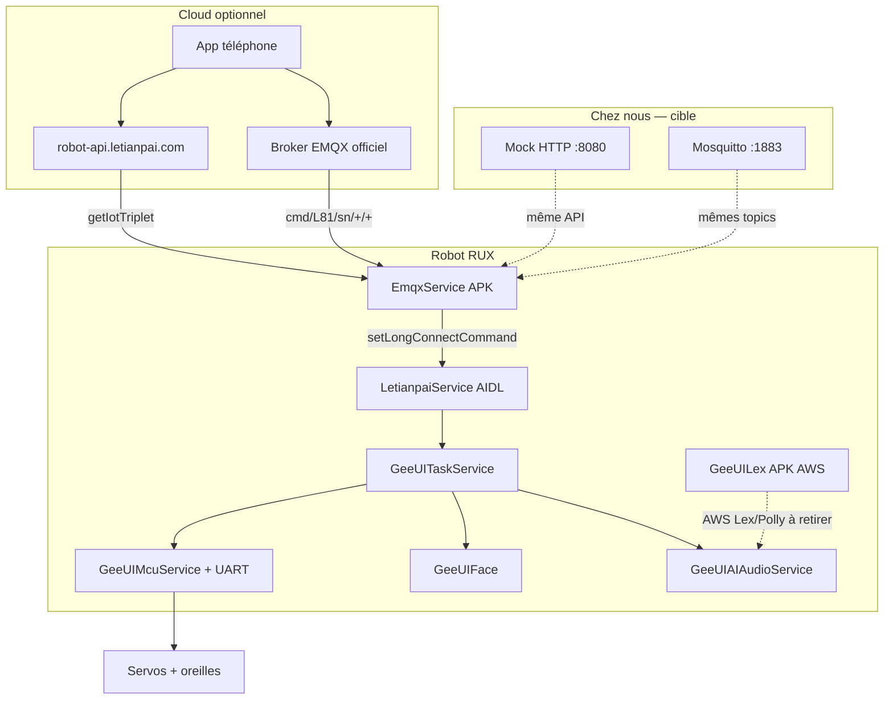
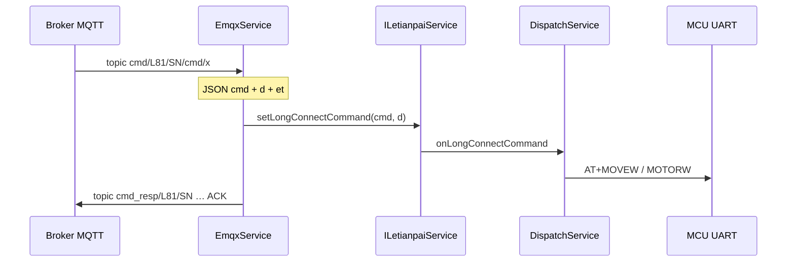
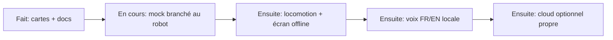

# Roadmap RUX — suivi des étapes

2026-09-26. Objectif : offline d’abord, cloud en option, voix FR/EN.

---

## Comment connaître les topics MQTT (sans jargon)

Un **topic** n’est pas une URL. C’est le nom du « canal radio » sur le broker.

On en a **déjà deux** extraits de l’APK EmqxService (reverse du binaire) :

- le robot **écoute** : `cmd/L81/<numero_serie>/+/+`
- le robot **répond** : `cmd_resp/L81/<numero_serie>/...`

Pour **voir ceux vraiment utilisés au runtime** (le reverse ne remplace pas ça) :

1. Lancer Mosquitto sur le PC (`third_party_demo/mock`).
2. Faire pointer le robot vers ce PC (`Constants.kt` + réponse `getIotTriplet.remote_host`).
3. Sur le PC : `mosquitto_sub -h 127.0.0.1 -t '#' -v`
4. Allumer le robot. `#` = « tous les canaux ». Tout ce qui s’affiche est un topic réel.

Sans robot branché sur le mock, on ne peut pas lister plus que ce que l’APK contient.

### Reverse engineering, en pratique ici

| Niveau | Quoi | Déjà fait |
|---|---|---|
| Source forks | lire Java/Kotlin | AIDL, MCU, LtpNetWork |
| APK fermé | `strings` + dex (androguard) | EmqxService, GeeUILex |
| Runtime | logcat + MQTT `#` + tcpdump | **à faire sur le robot** |
| ROM | packages/apps prebuilt | Drive partiel |

On ne « devine » pas un topic : soit il est écrit dans le dex, soit on le voit passer sur le fil.

---

## Architecture (ce qui tourne aujourd’hui)

---

## État global

| Zone | Statut | Livrable |
|---|---|---|
| Carte repos / git fédéré | fait | VISION |
| AIDL | fait | AIDL-CONTRACTS |
| Vocab MCU | fait | MCU-VOCAB |
| JSON commandes | fait | JSON-COMMANDS |
| HTTP API liste | fait | API-URLS |
| MQTT topics APK | fait | MQTT-ENDPOINTS, EMQX-APK |
| GeeUILex APK | fait | GEEUILEX |
| Mock HTTP :8080 | code fait, **pas branché robot** | third_party_demo/mock |
| Mock MQTT :1883 | code fait, **pas de dump `#`** | docker-compose + pub.sh |
| Pointage Constants.kt | à faire | LtpNetWork |
| Boot launcher sans 404 | à faire | |
| Locomotion réelle | à faire | |
| STT/TTS FR+EN offline | à faire | remplacer Lex/Polly |
| Couper widgets CN | plus tard | news/stock/fans |

---

## Par module — fait / à approfondir

### LetianpaiService + GeeUITaskService
Intéressant : `DispatchService` (routage string → MCU/face/audio). Offline = ce bus doit marcher **sans** MQTT (commandes locales / ADB).

### GeeUIMcuService + MCU
Intéressant : `AT+MOVEW` / `MOTORW` / oreilles, servos 1–6. Test ADB → AIDL → UART. Beaucoup de code commenté (`McuCommandControlManager`).

### EmqxService (fermé)
Déjà reverse. Reste : dump runtime `#`, suffixe exact `cmd_resp`, TLS ou pas sur le LAN.

### LtpNetWork
Hosts encore `your-server.com`. **Prochaine action** : baseUrl → IP du mock. C’est le robinet cloud.

### GeeUILex + GeeUIAIAudioService
Lex = AWS + Sphinx EN. Cible : STT/TTS **FR+EN on-device** (Piper / Vosk / Whisper.cpp) branchés sur `setTTS` / `setSpeechCmd`. Couper AWS.

### GeeUIFace / Desktop / Time / Setting
UI locale. Peuvent tourner offline si on mock `user/weatherInfo` etc. ou si on cache.

### IdentService / MiIoT / OTA (APK seulement)
P2. Ident = visage. MiIoT = Chine. OTA = garder un canal fichier local, pas le cloud LTP.

### Widgets CN (News, Stock, Fans, …)
Basse priorité. On peut les laisser morts (404 mock) ou les retirer de la ROM.

---

## Prochaines actions concrètes (ordre)

1. Pointer `LtpNetWork` `Constants.kt` vers le mock LAN + triplet MQTT `remote_host` = PC.
2. Boot robot, noter les HTTP 404, les ajouter au mock (`user/*` en plus de `device/*`).
3. `mosquitto_sub -t '#' -v` → coller la liste des topics réels dans MQTT-ENDPOINTS.
4. `pub.sh controlMotion` → vérifier les pieds.
5. Commande AIDL locale sans MQTT (preuve offline motion).
6. Prototype TTS FR (Piper) à la place de Polly.

---

## Docs déjà écrits

VISION · STATUS · AIDL-CONTRACTS · MCU-VOCAB · JSON-COMMANDS · API-URLS · MQTT-PAYLOADS · MQTT-ENDPOINTS · EMQX-APK · GEEUILEX · MOCK-STACK
