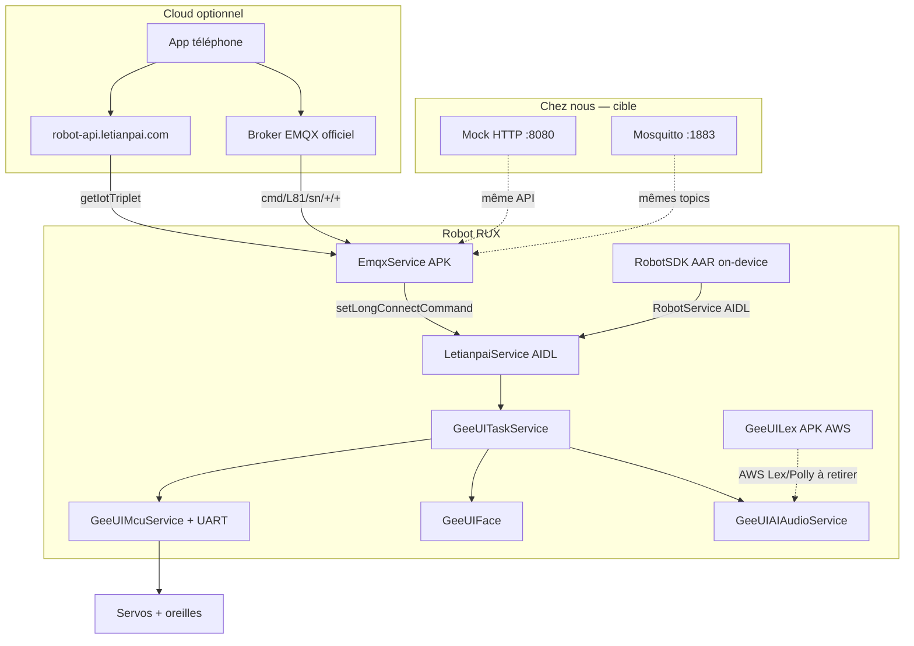

# Roadmap RUX — suivi des étapes

2026-09-26. Objectif : offline d’abord, cloud en option, voix FR/EN.
Maj 2026-09-27 : catalogue officiel RobotSDK (boutique) ingéré — docs/ROBOTSDK.md.

---

## Comment connaître les topics MQTT (sans jargon)

Un **topic** n’est pas une URL. C’est le nom du « canal radio » sur le broker.

On en a **déjà deux** extraits de l’APK EmqxService :

- le robot **écoute** : `cmd/L81/<numero_serie>/+/+`
- le robot **répond** : `cmd_resp/L81/<numero_serie>/...`

Pour **voir ceux vraiment utilisés au runtime** :

1. Lancer Mosquitto sur le PC (`third_party_demo/mock`).
2. Faire pointer le robot vers ce PC (`Constants.kt` + réponse `getIotTriplet.remote_host`).
3. Sur le PC : `mosquitto_sub -h 127.0.0.1 -t '#' -v`
4. Allumer le robot. `#` = « tous les canaux ».

MQTT long-connect = **TCP :1883**, pas de certificat. Le TLS ne concerne que le HTTP bootstrap.

---

## Architecture (ce qui tourne aujourd’hui)

```mermaid
flowchart TB
  subgraph optionnel [Cloud optionnel]
    Phone[App téléphone]
    LTP[robot-api.letianpai.com]
    EMQXcloud[Broker EMQX officiel]
  end

  subgraph local [Chez nous — cible]
    MockHTTP[Mock HTTP :8080]
    Mosq[Mosquitto :1883]
  end

  subgraph robot [Robot RUX]
    Emqx[EmqxService APK]
    LtpS[LetianpaiService AIDL]
    Dispatch[GeeUITaskService]
    MCU[GeeUIMcuService + UART]
    Face[GeeUIFace]
    Audio[GeeUIAIAudioService]
    Lex[GeeUILex APK AWS]
    SDK[RobotSDK AAR on-device]
  end

  Phone --> EMQXcloud
  Phone --> LTP
  LTP -->|getIotTriplet| Emqx
  EMQXcloud -->|cmd/L81/sn/+/+| Emqx
  MockHTTP -.->|même API| Emqx
  Mosq -.->|mêmes topics| Emqx
  Emqx -->|setLongConnectCommand| LtpS
  SDK -->|RobotService AIDL| LtpS
  LtpS --> Dispatch
  Dispatch --> MCU
  Dispatch --> Face
  Dispatch --> Audio
  Lex -.->|AWS Lex/Polly à retirer| Audio
  MCU --> Pieds[Servos + oreilles]
```

---

## État global

| Zone | Statut | Livrable |
|---|---|---|
| Carte repos / git fédéré | fait | VISION |
| AIDL | fait | AIDL-CONTRACTS |
| Vocab MCU | fait | MCU-VOCAB |
| JSON commandes | fait | JSON-COMMANDS |
| RobotSDK officiel + AAR 2.2 | fait | ROBOTSDK, MOTION-CODES |
| HTTP API liste | fait | API-URLS |
| MQTT topics APK | fait | MQTT-ENDPOINTS, EMQX-APK |
| GeeUILex APK | fait | GEEUILEX |
| Mock HTTP :8080 | code fait, **pas branché robot** | third_party_demo/mock |
| Mock MQTT :1883 | code fait, **pas de dump `#`** | docker-compose + pub.sh |
| Pointage Constants.kt | à faire | LtpNetWork |
| Boot launcher sans 404 | à faire | |
| Locomotion réelle | à faire | |
| STT/TTS FR+EN offline | à faire | remplacer Lex/Polly |
| Couper widgets CN | plus tard | news/stock/fans |

---

## Prochaines actions concrètes (ordre)

1. Pointer `LtpNetWork` `Constants.kt` vers le mock LAN + triplet MQTT `remote_host` = PC.
2. Boot robot, noter les HTTP 404, les ajouter au mock.
3. `mosquitto_sub -t '#' -v` → MQTT-ENDPOINTS.
4. `pub.sh controlMotion` (number 98 ou 63) → pieds.
5. Commande AIDL locale / RobotSDK sans MQTT.
6. Prototype TTS FR (Piper) à la place de Polly.

---

## Docs déjà écrits

VISION · STATUS · AIDL-CONTRACTS · MCU-VOCAB · JSON-COMMANDS · ROBOTSDK · MOTION-CODES · API-URLS · MQTT-PAYLOADS · MQTT-ENDPOINTS · EMQX-APK · GEEUILEX · MOCK-STACK
